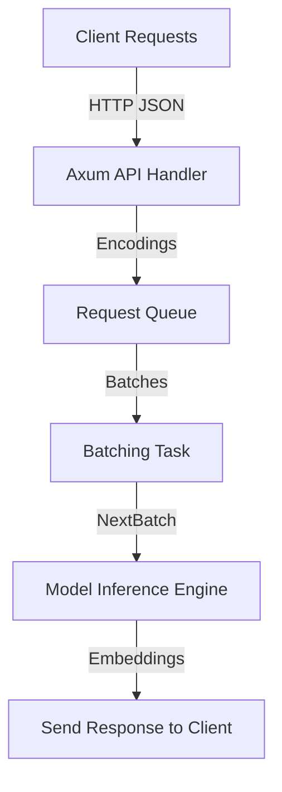

# AI Embedding Inference Server  

This repository provides a **production-ready inference server** for running text embedding models (and related tasks) with:  

- **Batching & concurrency control** – efficient GPU/CPU utilization  
- **Backpressure & error handling** – returns errors when overloaded, instead of hanging  
- **Rate limiting & authentication** – per-user / per-key governor  
- **Metrics & observability** – structured tracing + Prometheus counters  
- **OpenAI-compatible embedding API** – `/embed` endpoint  

---

## ✨ Features  

- **Flexible Model Loading**  
  - Load Hugging Face models (`--model-id BAAI/bge-large-en-v1.5`) or local directories  
  - Configurable revision, dtype (`float16`, etc.), and pooling strategy  

- **Embedding API** (`/embed`)  
  - Supports **single** and **batch** requests  
  - Configurable truncation, normalization, dimensions, and prompts  
  - Batch-size validation (`max_client_batch_size`)  

- **Robust Error Handling**  
  - Queue full → returns `429 Too Many Requests`  
  - Tokenization errors, empty batches, invalid batch sizes → descriptive error JSON  
  - Inference failures → `500 Internal Server Error`  

- **Scalable Concurrency Model**  
  - Queue + batching task + backend task architecture  
  - `max_batch_tokens` and `max_batch_requests` to control GPU/CPU load  
  - `max_concurrent_requests` for backpressure handling  

- **Rate Limiting & Security**  
  - Configurable `api_key` support  
  - Request governor (`80 req/s`, `burst=50`) with background cleanup  
  - Auth middleware (`Bearer <API_KEY>`)  

- **Observability**  
  - JSON or human-readable logs  
  - Tracing spans with optional disabling  
  - Prometheus counters + histograms for:  
    - Request counts/success/failures  
    - Tokenization, queue, and inference timings  
    - Queue size, batch size, and batch token usage  

---

## 🚀 Quickstart  

### Run Server  

```bash
cargo run --release -- \
  --model-id BAAI/bge-large-en-v1.5 \
  --max-concurrent-requests 4 \
  --max-batch-tokens 1384 \
  --max-batch-requests 5 \
  --port 8080
```

The server will start at:

http://0.0.0.0:8080


⸻

Embed API

Single Input

curl -X POST http://localhost:8080/api/v1/embed \
  -H "Content-Type: application/json" \
  -d '{
    "inputs": "Hello world",
    "truncate": true,
    "truncation_direction": "Right",
    "prompt_name": null,
    "normalize": true,
    "dimensions": null
  }'

Batch Input

curl -X POST http://localhost:8080/api/v1/embed \
  -H "Content-Type: application/json" \
  -d '{
    "inputs": ["First document", "Second document"],
    "truncate": true
  }'


⸻
## 📦 Configuration

| Flag                         | Env                        | Default                     | Description                              |
|------------------------------|----------------------------|-----------------------------|------------------------------------------|
| `--model-id`                 | `MODEL_ID`                 | `./Qwen3-Embedding-0.6B`    | Hugging Face model ID or local path      |
| `--revision`                 | `REVISION`                 | *none*                      | Hub revision/commit/branch               |
| `--tokenization-workers`     | `TOKENIZATION_WORKERS`     | CPU cores                   | Parallel tokenizers                      |
| `--dtype`                    | `DTYPE`                    | `float16`                   | Force model dtype                        |
| `--pooling`                  | `POOLING`                  | model config                | Override pooling                         |
| `--max-concurrent-requests`  | `MAX_CONCURRENT_REQUESTS`  | `1`                         | Limit concurrent requests                |
| `--max-batch-tokens`         | `MAX_BATCH_TOKENS`         | `1384`                      | Max tokens per batch                     |
| `--max-batch-requests`       | `MAX_BATCH_REQUESTS`       | `5`                         | Max requests per batch                   |
| `--max-client-batch-size`    | `MAX_CLIENT_BATCH_SIZE`    | `2`                         | Max inputs per client request            |
| `--hostname`                 | `HOSTNAME`                 | `0.0.0.0`                   | Bind address                             |
| `--port`                     | `PORT`                     | `8080`                      | HTTP port                                |
| `--api-key`                  | `API_KEY`                  | *none*                      | Require bearer token                     |
| `--json-output`              | `JSON_OUTPUT`              | `false`                     | JSON logs for telemetry                  |
| `--otlp-endpoint`            | `OTLP_ENDPOINT`            | *none*                      | OpenTelemetry OTLP gRPC endpoint         |
| `--otlp-service-name`        | `OTLP_SERVICE_NAME`        | `s3-embedding.server`       | OTLP service name                        |

⸻

## 🏗️ Architecture

The server is built with a modular queue + batching system to ensure high throughput while preventing overload:  


⸻
## 📤 Example Response

A successful embedding request returns JSON with embeddings and metadata:

```json
{
  "data": [
    {
      "embedding": [0.0123, -0.0456, 0.0789, ...],
      "index": 0
    }
  ],
  "usage": {
    "prompt_tokens": 42,
    "total_tokens": 42
  },
  "timings": {
    "tokenization": "120µs",
    "queue": "2ms",
    "inference": "35ms"
  }
}
```
⸻
